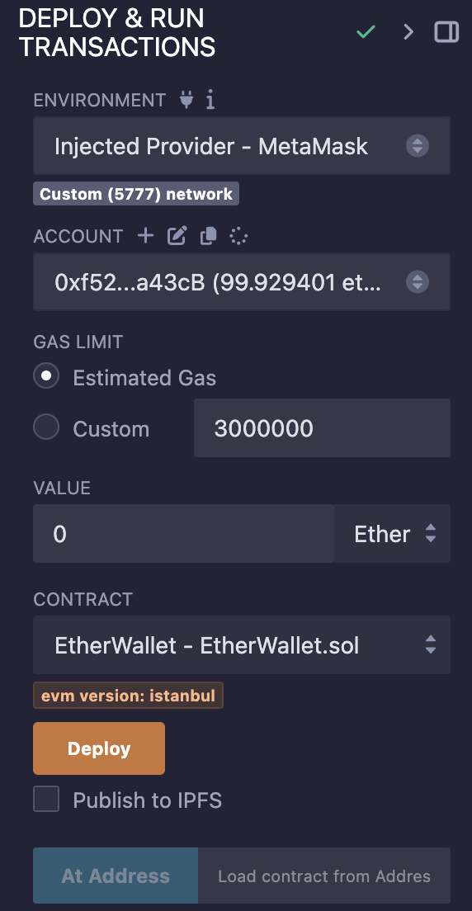
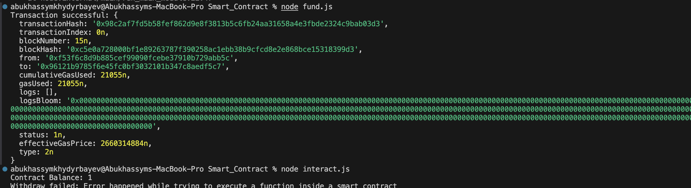
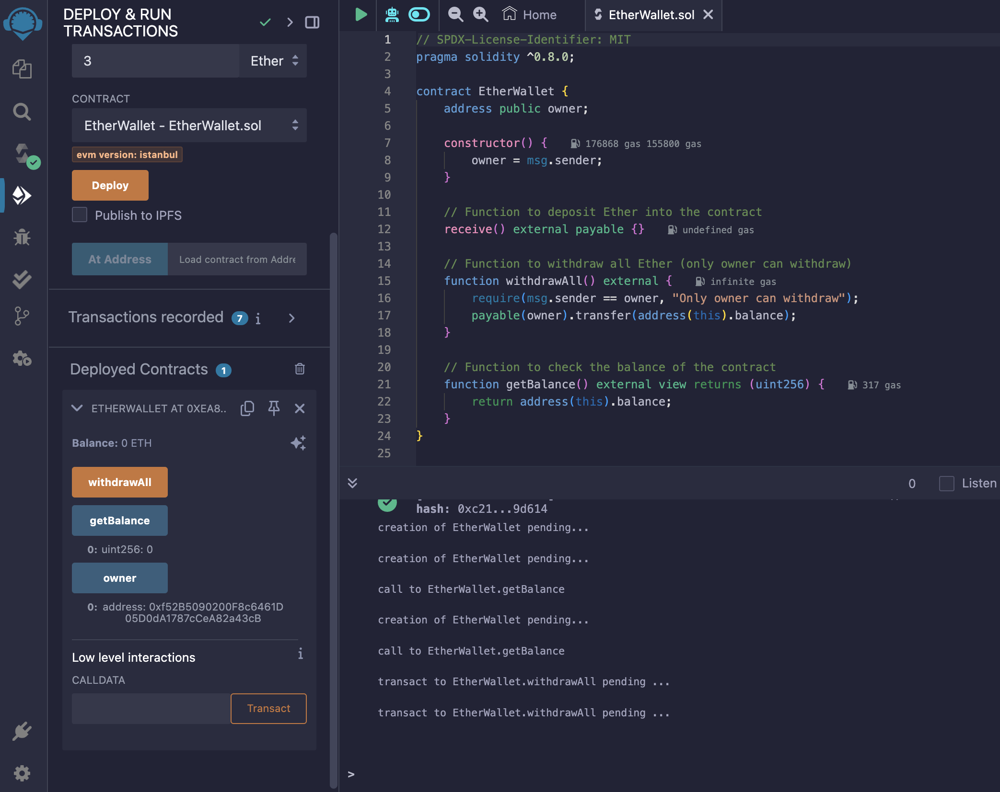
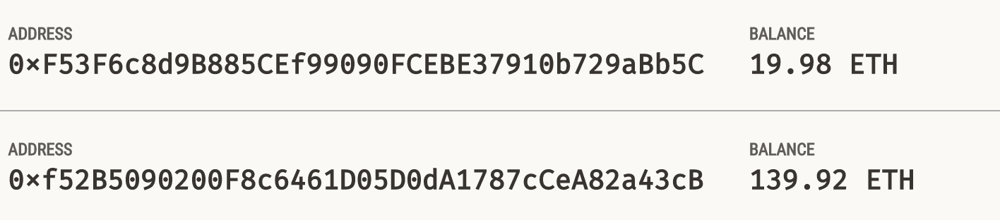
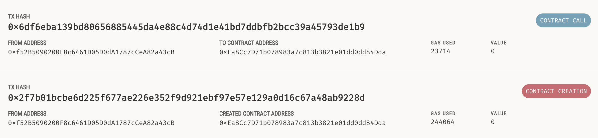

# EtherWallet SMART CONTRACT

## Prerequisites
- Ganache (running on port 7545)
- Node.js and npm installed
- Remix IDE
- Web3.js library (`npm install web3`)

## Step 1: Deploy Smart Contract

1. Open Remix IDE (https://remix.ethereum.org)
2. Create a new file named `EtherWallet.sol` and paste the provided Solidity code
3. Compile the contract:
   - Select Solidity compiler version 0.8.0 or higher
   - Click "Compile EtherWallet.sol"
4. Deploy the contract:
   - Go to "Deploy & Run Transactions" tab
   - Select "Injected Provider - MetaMask" as environment
   - Click "Deploy"



## Step 2: Test Connection (connect.js)

1. Create a new directory for your project
2. Initialize npm project: `npm init -y`
3. Install Web3: `npm install web3`
4. Create `connect.js` with the provided code
5. Run the connection test:
```bash
node connect.js
```
Expected output: "done!"

## Step 3: Fund the Contract (fund.js)

1. Create `fund.js` with the provided code
2. Replace the contract address with your deployed contract address
3. Execute the funding script:
```bash
node fund.js
```
Expected output: Transaction receipt showing:
- Status: "0x1" (success)
- Value transferred: 10 ETH
- Gas used



## Step 4: Interact with Contract (interact.js)

1. Create `interact.js` with the provided code
2. Update the following:
   - Contract address to match your deployed contract
   - ABI (should match the provided ABI)
3. Run the interaction script:
```bash
node interact.js
```
Expected output:
- Contract Owner address
- Sender Account address
- Contract Balance
- Withdrawal status

## Verification Steps

1. Check Ganache UI for:
   - Contract creation transaction
   - Fund transfer transaction
   - Withdrawal transaction



2. Verify account balances changed appropriately



3. Confirm all transactions show successful status




## Common Issues and Solutions

1. Connection errors:
   - Ensure Ganache is running on port 7545
   - Check Web3 provider URL

2. Transaction failures:
   - Verify account has sufficient funds
   - Check gas limit is sufficient
   - Ensure correct contract address

3. Permission errors:
   - Verify sender account matches contract owner for withdrawal
   - Check account is unlocked in Ganache

## License
This project is licensed under the MIT License - see the [LICENSE](LICENSE) file for detail
